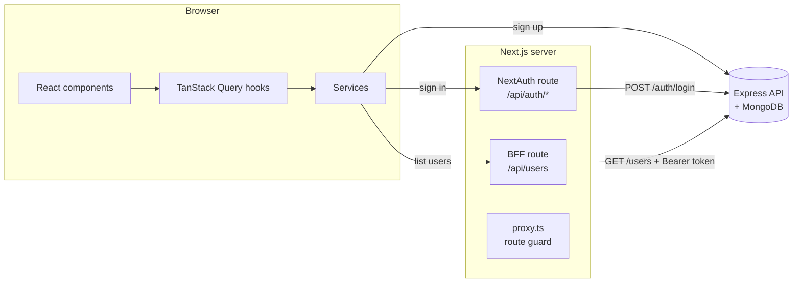

<div align="center">


# Userz Growth

User management app — sign up, sign in and browse registered users.<br/>
Originally built as a technical challenge for **Growth Machine** (2024) and refactored in 2026 as a portfolio project.

[](https://github.com/Bizzye/frontend-growth-machine/actions/workflows/ci.yml)


[Backend repository](https://github.com/Bizzye/backend-growth-machine) · [Code review](docs/CODE_REVIEW.md)


</div>

## Features

- **Sign up** with client-side validation that mirrors the API rules (strong password, names, birth date not in the future).
- **Sign in** with e-mail and password through NextAuth (credentials provider, JWT session).
- **Users dashboard** listing everyone registered, with loading, empty and error states (with retry).
- **Route protection** in the Next.js proxy: anonymous users can't reach `/home`; signed-in users skip `/login` and `/register`.
- Friendly, non-revealing error messages (no user enumeration) shown as toasts.
- Accessible forms (labels, `aria-invalid`, `aria-describedby`, autocomplete) and responsive dark UI.

## Screenshots

|                         Sign in                          |                    Sign up (validation)                    |
| :------------------------------------------------------: | :--------------------------------------------------------: |
|                    |                   |
|                 **Invalid credentials**                  |                 **Client-side validation**                 |
|  |  |

<p align="center">
  
</p>

> Screenshots are generated automatically with Playwright: `npm run screenshots`.

## Tech stack

| Area         | Tools                                                                              |
| ------------ | ---------------------------------------------------------------------------------- |
| Framework    | Next.js 16 (App Router, proxy, route handlers), React 19, TypeScript 6             |
| Styling      | Tailwind CSS 4, shadcn/ui (Radix primitives), lucide-react                         |
| Data & forms | TanStack Query 5, React Hook Form 7, Zod 4, Axios (fetch adapter)                  |
| Auth         | NextAuth 4 (credentials provider, encrypted JWT cookie)                            |
| Quality      | ESLint 9 (flat config), Prettier, Husky + lint-staged, strict TypeScript           |
| Tests        | Vitest + Testing Library + MSW (unit/integration), Playwright (E2E)                |
| Delivery     | GitHub Actions (CI + CD to GHCR), Docker (standalone output, non-root), Dependabot |

## Architecture



- **Feature-based structure** — each domain (`auth`, `users`) owns its components, hooks and schemas.
- **Service layer** — components never call HTTP directly; services return typed data or throw an `AppError` with a user-facing message.
- **Error mapping** — the API returns machine-readable codes (`INVALID_CREDENTIALS`, `USER_ALREADY_EXISTS`…) mapped to UI messages in one place (`src/lib/errors.ts`).
- **Backend-for-frontend** — the API token is stored only in NextAuth's encrypted cookie. Protected data goes through a Next.js route handler that attaches the token server-side, so it is never exposed to browser JavaScript.
- **Validated configuration** — environment variables are parsed with Zod (`src/config/env.ts`).
- **Security headers** — `X-Frame-Options`, `X-Content-Type-Options`, `Referrer-Policy`, `Permissions-Policy`, HSTS; `X-Powered-By` disabled.

```
src/
├── app/                     # Routes (App Router)
│   ├── (auth)/login|register
│   ├── home/                # Protected users dashboard
│   └── api/                 # NextAuth + BFF route handlers
├── components/
│   ├── layout/              # Header
│   └── ui/                  # shadcn/ui primitives
├── features/
│   ├── auth/                # Forms, mutations (useLogin/useRegister), Zod schemas
│   └── users/               # Users list/table, useUsers query
├── services/                # HTTP clients, auth and users services
├── lib/                     # NextAuth options, errors, formatters, query client
├── config/env.ts            # Validated env vars
├── types/                   # Domain types + NextAuth augmentation
└── proxy.ts                 # Route guard (Next.js 16 proxy)
tests/
├── unit/                    # Vitest + Testing Library + MSW
├── e2e/                     # Playwright specs + in-memory mock of the API
├── fixtures/                # Shared test data
└── mocks/                   # MSW handlers
```

## Getting started

### Full stack with Docker (recommended)

Clone both repositories side by side and start everything (MongoDB + API + frontend):

```bash
git clone https://github.com/Bizzye/frontend-growth-machine.git
git clone https://github.com/Bizzye/backend-growth-machine.git
cd frontend-growth-machine

docker compose up --build -d
docker compose exec backend node dist/scripts/seed.js   # optional demo users
```

Open <http://localhost:3000> and sign in with `jane.cooper@example.com` / `Str0ng!Pass` (after seeding).

### Frontend only

Requirements: Node.js 24 (see `.nvmrc`) and the [API](https://github.com/Bizzye/backend-growth-machine) running.

```bash
cp .env.example .env.local
npm install
npm run dev
```

No backend at hand? Run the in-memory mock API instead:

```bash
npm run mock:api                                         # http://localhost:4010/api
NEXT_PUBLIC_API_URL=http://localhost:4010/api npm run dev
```

### Environment variables

| Variable              | Description                                                        | Default                     |
| --------------------- | ------------------------------------------------------------------ | --------------------------- |
| `NEXT_PUBLIC_API_URL` | API URL used by the browser (inlined at build time)                | `http://localhost:3333/api` |
| `API_URL`             | API URL used by the Next.js server (e.g. Docker network hostname)  | `NEXT_PUBLIC_API_URL`       |
| `NEXTAUTH_URL`        | Public URL of this app                                             | —                           |
| `NEXTAUTH_SECRET`     | Secret used to encrypt the session cookie (required in production) | —                           |

## Scripts

| Script                  | Description                                         |
| ----------------------- | --------------------------------------------------- |
| `npm run dev`           | Development server                                  |
| `npm run build`         | Production build (standalone output)                |
| `npm test`              | Unit/integration tests (Vitest)                     |
| `npm run test:coverage` | Tests with coverage report and thresholds           |
| `npm run test:e2e`      | E2E tests (Playwright, production build + mock API) |
| `npm run screenshots`   | Regenerates the README screenshots                  |
| `npm run mock:api`      | In-memory implementation of the API contract        |
| `npm run lint`          | ESLint                                              |
| `npm run format`        | Prettier                                            |
| `npm run typecheck`     | TypeScript                                          |
| `npm run validate`      | Format check + lint + typecheck + unit tests        |

## Testing strategy

- **Unit / integration (Vitest)** — schemas, error mapping, formatters, services (HTTP mocked with MSW), components rendered with Testing Library (forms, states, accessibility), the BFF route handler and the proxy. ~99% coverage with enforced thresholds.
- **End-to-end (Playwright)** — real browser against a production build: route protection, sign in/out, sign up, duplicated e-mail, users listing, security headers. The backend is replaced by a small in-memory server that implements the same contract (`tests/e2e/mock-api`), so E2E runs anywhere, including CI, without MongoDB. The same suite also runs against the real Docker stack: `E2E_BASE_URL=http://localhost:3000 npm run test:e2e` (after seeding).

## CI/CD

- **CI** (`.github/workflows/ci.yml`) — on every push/PR: format check, lint, typecheck, unit tests with coverage, E2E tests (report uploaded on failure) and a Docker build.
- **CD** (`.github/workflows/release.yml`) — after CI passes on `main` (and on `v*.*.*` tags) a production image is published to `ghcr.io/bizzye/frontend-growth-machine`. Set the repository variable `NEXT_PUBLIC_API_URL` to bake the public API URL into the image.
- **Dependabot** keeps npm packages and GitHub Actions up to date.

## License

MIT
