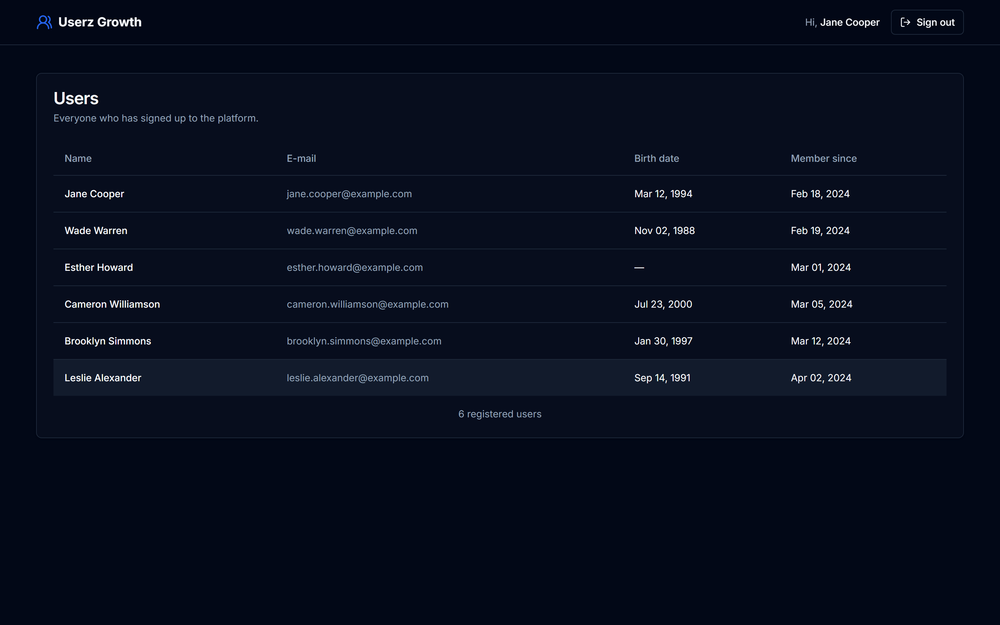
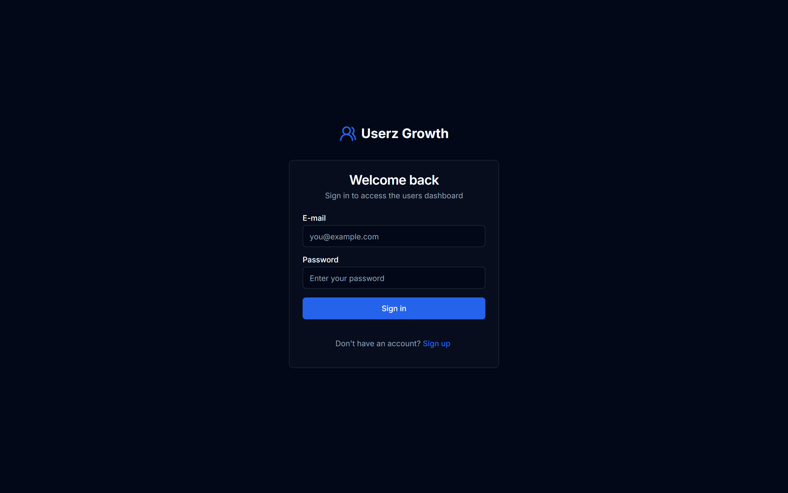
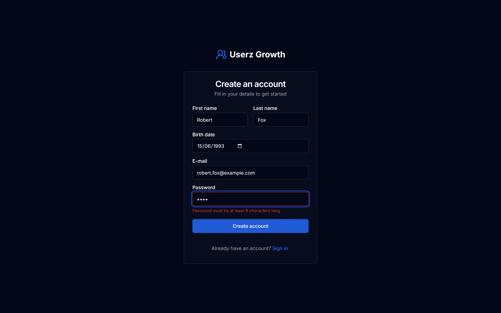
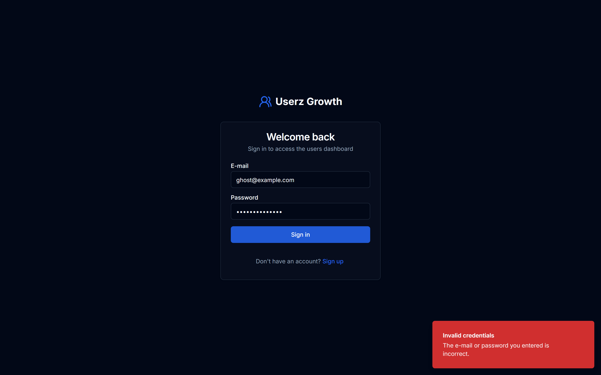
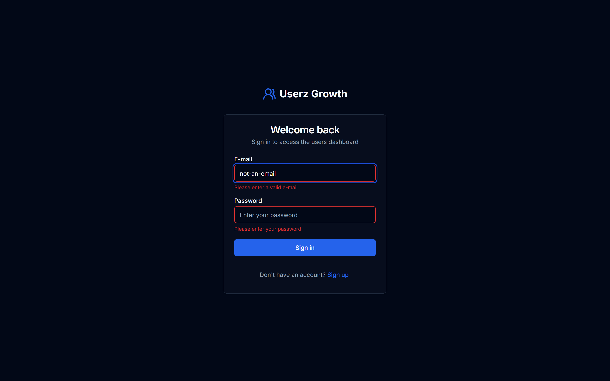
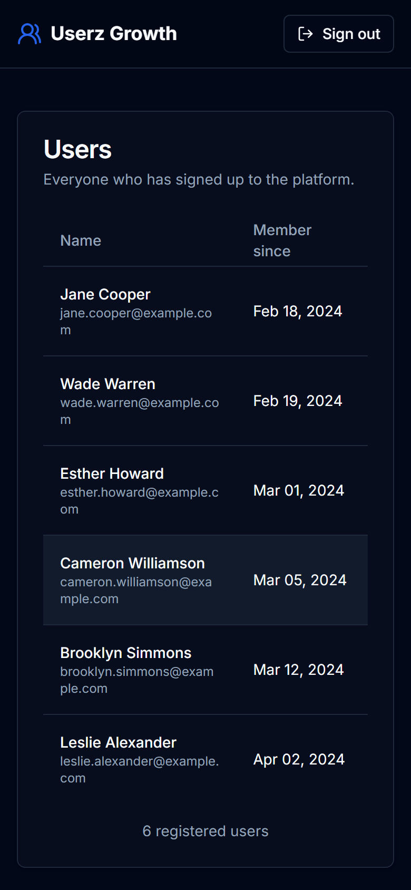
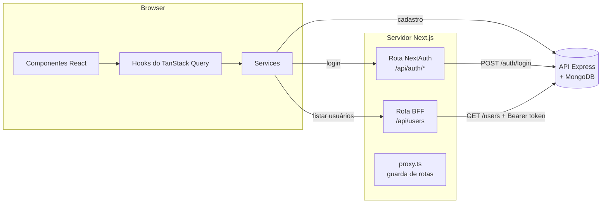

<div align="center">


# Userz Growth

Aplicação de gestão de usuários — cadastro, login e listagem de usuários cadastrados.<br/>
Criada originalmente como desafio técnico para a **Growth Machine** (2024) e refatorada em 2026 como projeto de portfólio.

[](https://github.com/Bizzye/frontend-growth-machine/actions/workflows/ci.yml)


[Repositório do backend](https://github.com/Bizzye/backend-growth-machine) · [Code review](docs/CODE_REVIEW.md)



</div>

## Funcionalidades

- **Cadastro** com validação no cliente espelhando as regras da API (senha forte, nomes, data de nascimento não futura).
- **Login** com e-mail e senha via NextAuth (credentials provider, sessão JWT).
- **Painel de usuários** com todos os cadastrados e estados de carregamento, vazio e erro (com "tentar novamente").
- **Proteção de rotas** no proxy do Next.js: visitantes não acessam `/home`; usuários logados pulam `/login` e `/register`.
- **Sessão consistente**: quando o token da API expira, o usuário é deslogado automaticamente em vez de ficar preso em erros 401.
- Mensagens de erro amigáveis e que não revelam quais e-mails existem (sem _user enumeration_), exibidas em toasts.
- Formulários acessíveis (labels, `aria-invalid`, `aria-describedby`, autocomplete) e interface escura responsiva.

> A interface e o código estão em inglês para manter a codebase padronizada.

## Screenshots

|                           Login                            |                     Cadastro (validação)                     |
| :--------------------------------------------------------: | :----------------------------------------------------------: |
|                        |                    |
|                 **Credenciais inválidas**                  |                   **Validação no cliente**                   |
|  |  |

<p align="center">
  
</p>

> Os screenshots são gerados automaticamente com Playwright: `npm run screenshots`.

## Stack

| Área          | Ferramentas                                                                                    |
| ------------- | ---------------------------------------------------------------------------------------------- |
| Framework     | Next.js 16 (App Router, proxy, route handlers), React 19, TypeScript 6                         |
| Estilo        | Tailwind CSS 4, shadcn/ui (primitivos Radix), lucide-react                                     |
| Dados e forms | TanStack Query 5, React Hook Form 7, Zod 4, Axios (adapter fetch)                              |
| Autenticação  | NextAuth 4 (credentials provider, cookie JWT criptografado)                                    |
| Qualidade     | ESLint 9 (flat config), Prettier, Husky + lint-staged, TypeScript estrito                      |
| Testes        | Vitest + Testing Library + MSW (unitários/integração), Playwright (E2E)                        |
| Entrega       | GitHub Actions (CI + CD para o GHCR), Docker (output standalone, usuário não-root), Dependabot |

## Arquitetura



- **Estrutura por feature** — cada domínio (`auth`, `users`) tem seus componentes, hooks e schemas.
- **Camada de services** — componentes nunca fazem HTTP direto; services retornam dados tipados ou lançam um `AppError` com mensagem pronta para o usuário.
- **Mapeamento de erros** — a API retorna códigos legíveis por máquina (`INVALID_CREDENTIALS`, `USER_ALREADY_EXISTS`…) traduzidos para mensagens de UI em um único lugar (`src/lib/errors.ts`).
- **Backend-for-frontend (BFF)** — o token da API fica apenas no cookie criptografado do NextAuth. Dados protegidos passam por um route handler do Next.js que adiciona o token no servidor, então ele nunca chega ao JavaScript do navegador.
- **Configuração validada** — variáveis de ambiente validadas com Zod (`src/config/env.ts`).
- **Headers de segurança** — `X-Frame-Options`, `X-Content-Type-Options`, `Referrer-Policy`, `Permissions-Policy`, HSTS; `X-Powered-By` desativado.

```
src/
├── app/                     # Rotas (App Router)
│   ├── (auth)/login|register
│   ├── home/                # Painel de usuários (protegido)
│   └── api/                 # Route handlers do NextAuth e do BFF
├── components/
│   ├── layout/              # Header
│   └── ui/                  # Primitivos do shadcn/ui
├── features/
│   ├── auth/                # Formulários, mutations (useLogin/useRegister), schemas Zod
│   └── users/               # Lista/tabela de usuários, query useUsers
├── services/                # Clientes HTTP e services de auth e users
├── lib/                     # Opções do NextAuth, sessão, erros, formatadores, query client
├── config/env.ts            # Variáveis de ambiente validadas
├── types/                   # Tipos de domínio + augmentation do NextAuth
└── proxy.ts                 # Guarda de rotas (proxy do Next.js 16)
tests/
├── unit/                    # Vitest + Testing Library + MSW
├── e2e/                     # Specs do Playwright + mock em memória da API
├── fixtures/                # Dados de teste compartilhados
└── mocks/                   # Handlers do MSW
```

## Como rodar

### Stack completa com Docker (recomendado)

Clone os dois repositórios lado a lado e suba tudo (MongoDB + API + frontend):

```bash
git clone https://github.com/Bizzye/frontend-growth-machine.git
git clone https://github.com/Bizzye/backend-growth-machine.git
cd frontend-growth-machine

docker compose up --build -d
docker compose exec backend node dist/scripts/seed.js   # opcional: usuários de demonstração
```

Acesse <http://localhost:3000> e entre com `jane.cooper@example.com` / `Str0ng!Pass` (após o seed).

### Apenas o frontend

Requisitos: Node.js 24 (veja `.nvmrc`) e a [API](https://github.com/Bizzye/backend-growth-machine) rodando.

```bash
cp .env.example .env.local
npm install
npm run dev
```

Sem backend por perto? Use a API mock em memória:

```bash
npm run mock:api                                         # http://localhost:4010/api
NEXT_PUBLIC_API_URL=http://localhost:4010/api npm run dev
```

### Variáveis de ambiente

| Variável              | Descrição                                                             | Padrão                      |
| --------------------- | --------------------------------------------------------------------- | --------------------------- |
| `NEXT_PUBLIC_API_URL` | URL da API usada pelo navegador (embutida no build)                   | `http://localhost:3333/api` |
| `API_URL`             | URL da API usada pelo servidor Next.js (ex.: hostname da rede Docker) | `NEXT_PUBLIC_API_URL`       |
| `NEXTAUTH_URL`        | URL pública desta aplicação                                           | —                           |
| `NEXTAUTH_SECRET`     | Segredo que criptografa o cookie de sessão (obrigatório em produção)  | —                           |

## Scripts

| Script                  | Descrição                                             |
| ----------------------- | ----------------------------------------------------- |
| `npm run dev`           | Servidor de desenvolvimento                           |
| `npm run build`         | Build de produção (output standalone)                 |
| `npm test`              | Testes unitários/integração (Vitest)                  |
| `npm run test:coverage` | Testes com relatório de cobertura e thresholds        |
| `npm run test:e2e`      | Testes E2E (Playwright, build de produção + API mock) |
| `npm run screenshots`   | Gera novamente os screenshots do README               |
| `npm run mock:api`      | Implementação em memória do contrato da API           |
| `npm run lint`          | ESLint                                                |
| `npm run format`        | Prettier                                              |
| `npm run typecheck`     | TypeScript                                            |
| `npm run validate`      | Format check + lint + typecheck + testes unitários    |

## Estratégia de testes

- **Unitários / integração (Vitest)** — schemas, mapeamento de erros, formatadores, sessão, services (HTTP mockado com MSW), componentes renderizados com Testing Library (formulários, estados, acessibilidade), o route handler do BFF e o proxy. ~99% de cobertura com thresholds obrigatórios.
- **End-to-end (Playwright)** — navegador real contra um build de produção: proteção de rotas, login/logout, cadastro, e-mail duplicado, listagem e headers de segurança. O backend é substituído por um pequeno servidor em memória que implementa o mesmo contrato (`tests/e2e/mock-api`), então o E2E roda em qualquer lugar, inclusive no CI, sem MongoDB. A mesma suíte também roda contra a stack real no Docker: `E2E_BASE_URL=http://localhost:3000 npm run test:e2e` (após o seed).

## CI/CD

- **CI** (`.github/workflows/ci.yml`) — a cada push/PR: format check, lint, typecheck, testes unitários com cobertura, testes E2E (relatório anexado em caso de falha, com cache do build do Next e dos browsers) e build da imagem Docker.
- **CD** (`.github/workflows/release.yml`) — depois que o CI passa na `main` (e em tags `v*.*.*`) a imagem de produção é publicada em `ghcr.io/bizzye/frontend-growth-machine`. Defina a variável de repositório `NEXT_PUBLIC_API_URL` para embutir a URL pública da API na imagem.
- **Dependabot** mantém os pacotes npm e as GitHub Actions atualizados.

## Licença

MIT
